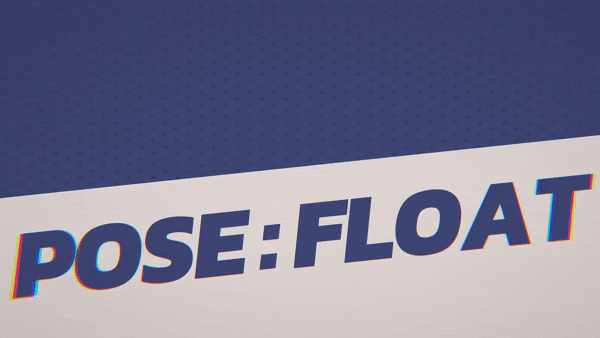

# sairi
*Anime style interactive graphic poster/game UI demo*

	
	

**A WebGL 2 build can be played [here](https://musicofmusix.github.io/sairi/). A modern desktop or mobile browser is recommended.**

This project was born as an attempt to blur the lines between *visually sophisticated but static* graphic posters and *interactive but relatively simpler* game UI. It aims to demonstrate an interface with a high focus on stylised visual aesthetics, specifically anime. Common design practices involving decorating the canvas with various shapes, typography, and visual effects were combined with user interactivity in Unity.

	

## Features
- A flat, anime style aesthetic with toon shading
- Fully rigged 3D anime schoolgirl character created in [VRoid Studio](https://vroid.com/en/studio) and exported in the VRM format
- Dynamic text and text effects that respond to user interaction

	

- A customisable polka-dot effect for backgrounds, implemented in URP Shadergraph

	

- Procedurally generated Bezier spline curves and particles (The core logic of this process is also implemented in Python: [bezierspline](https://github.com/musicofmusix/bezierspline))

	

- Realtime depth-based shader replacement for special masking effects

	

- Animated transitions for all interactive and non-interactive objects on screen
- Character eye-tracking and natural blinking

## Installation
The project was developed and tested on Unity version 2021.3.9f1 LTS. Simply clone this repository and open it in the editor. Newer versions of the Unity editor were not tested, but will likely work.

After opening the project, the [URP-UniVrm](https://github.com/EvelynGameDev/URP-UniVrm) [.unitypackage](https://github.com/EvelynGameDev/URP-UniVrm/releases) must be imported into the project for proper character rendering. The version used during development was 1.0.4.

Builds have been tested on macOS, Windows 11, iOS, and WebGL 2.

## Licensing
The main character model (“Sairi” or “Sairi Ponytail”) was created in VRoid Studio, and thus must comply with the [VRoid Studio Guidelines](https://vroid.com/en/studio/guidelines) and [VRoid Studio Terms of Service](https://policies.pixiv.net/en.html#vroidstudio) in addition to the [CC-BY-SA license](https://creativecommons.org/licenses/by-sa/2.0/) of the `.vrm` file itself. 

The three fonts used in the project: [Kanit](https://fonts.google.com/specimen/Kanit), [Daimon](https://www.1001fonts.com/damion-font.html), and [M PLUS 1p](https://fonts.google.com/specimen/M+PLUS+1p) are all licensed under the [SIL Open Font License](https://scripts.sil.org/OFL).

All other files that are not mentioned above and are not part of Unity (e.g. `/Assets/TextMesh Pro/` and project metadata, etc.) are licensed under the MIT license. Please feel free to use, modify, or simply take the concept and create derivative work.
